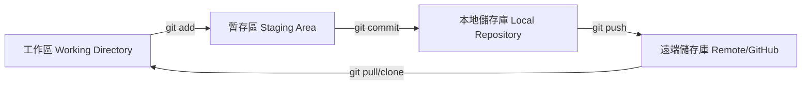

把讀書筆記（Markdown 檔案）整理到 GitHub 是一個非常棒的作法！這不僅能安全備份，還能利用 GitHub 的網路介面隨時閱讀，甚至能紀錄你的學習軌跡（刷滿綠色貢獻格子）。

以下為你整理出最流暢的**四個主要步驟**，讓你輕鬆把筆記搬上雲端：

---

## 1. 準備工作：建立 GitHub 儲存庫 (Repository)

首先，我們要在 GitHub 上挖一個坑（建立專案）來放你的筆記。

1. 登入 [GitHub](https://github.com/)。
2. 點擊右上角的 **「+」** 號，選擇 **New repository**。
3. 填寫設定：

* **Repository name**: 輸入你的筆記名稱（例如：`my-reading-notes` 或 `study-vault`）。
* **Public/Private**: 想公開分享選 Public，想當作私人秘密帳本選 Private。
* **Initialize this repository with**: 勾選 **Add a README.file**（這會自動產生一個首頁檔，方便你之後寫目錄）。

1. 點擊最下方的 **Create repository**。

---

## 2. 把儲存庫複製 (Clone) 到電腦

要把本機的 MD 檔傳上去，最快的方式是先把剛剛建好的雲端空間複製一份到電腦裡。

1. 在剛建好的 GitHub 頁面，點擊綠色的 **Code** 按鈕。
2. 複製裡面的 **HTTPS 網址**。
3. 打開你電腦的終端機（Terminal）或 Command Prompt (CMD)，切換到你想放筆記的資料夾，然後輸入以下指令：

```bash
git clone <你剛剛複製的HTTPS網址>
```

> *這時你的電腦會多出一個與專案同名的資料夾。*

---

## 3. 把 MD 檔案放進去並整理結構

現在，把你在電腦裡寫好的 MD 檔案直接**複製或剪下**，貼進剛剛 clone 下來的那個資料夾中。

為了讓筆記看起來井然有序，強烈建議建立**資料夾分類**。例如：

```text
my-reading-notes/
├── README.md               # 筆記總目錄（首頁）
├── 程式開發/
│   ├── JavaScript_筆記.md
│   └── Python_基礎.md
└── 商業管理/
    └── 原子習慣_讀書心得.md
```

### 💡 小技巧：善用 README.md 當作導覽手冊

你可以編輯 `README.md` 這個檔案，用 Markdown 的超連結語法（`[顯示文字](檔案路徑)`）做一個**精美的目錄**。例如：

```markdown
# 📚 我的讀書筆記總整理

歡迎來到我的學習筆記庫！

## 📂 分類目錄
* [JavaScript 核心觀念](./程式開發/JavaScript_筆記.md)
* [《原子習慣》讀書心得](./商業管理/原子習慣_讀書心得.md)
```

---

## 4. 上傳 (Push) 到 GitHub

檔案都擺好位置、目錄也寫好後，就可以透過 Git 指令把進度推上雲端了！在終端機中，確保你人在該筆記資料夾內，依序輸入以下三行指令：

```bash
# 1. 把所有新增、修改的檔案加到暫存區
git add .

# 2. 提交紀錄，並寫下你這次做了什麼（例如：新增原子習慣筆記）
git commit -m "feat: 新增原子習慣讀書心得與分類目錄"

# 3. 把檔案推送到 GitHub 雲端
git push origin main
```

*(註：如果你的預設分支叫 master，最後一行請改為 `git push origin master`)*

---

### ⚠️ 常見錯誤排查：出現 `warning: adding embedded git repository` 怎麼辦？

當你在終端機輸入 `git add .` 時，如果出現以下這串警告：
```text
warning: adding embedded git repository: study-vault
hint: You've added another git repository inside your current repository.
hint: Clones of the outer repository will not contain the contents of
hint: the embedded repository and will not know how to obtain it.
...
```

#### 🔍 這是什麼意思？
這代表**「你在一個 Git 儲存庫（外層）中，又放入了另一個 Git 儲存庫（內層）」**。
在你的狀況中，是因為你在外層資料夾（`d:\MyData\study`）執行了 `git init`，然後又在裡面執行了 `git clone` 下載了 `study-vault`（它本身也是一個獨立的 Git 儲存庫，內含 `.git` 資料夾）。

這樣會導致外層的 Git 預設**不會**去追蹤 `study-vault` 資料夾裡面的任何檔案（如你的 MD 筆記檔）。如果直接上傳，GitHub 上的 `study-vault` 會變成一個點不進去的空資料夾（灰色子模組圖示）。

---

#### 🛠️ 如何解決？（推薦做法：只保留筆記庫的 Git）

如果你**只想管理 `study-vault` 這個筆記資料夾的內容**，外層的 `study` 資料夾不需要獨立的 Git 紀錄，請按照以下步驟修復：

1. **清除外層 Git 對該資料夾的快取紀錄**（在 `d:\MyData\study` 目錄下執行）：
   ```bash
   git rm --cached study-vault
   ```
   *(這會告訴外層 Git 不要把內層當作子模組追蹤)*

2. **切換終端機目錄進入 `study-vault`**：
   *未來的 Git 新增、提交、推送指令，都必須先切換進入這個資料夾操作！*
   ```bash
   cd study-vault
   ```

3. **在正確的目錄重新上傳：**
   ```bash
   git add .
   git commit -m "feat: 新增筆記與目錄"
   git push origin main
   ```

4. *(選用)* 如果你想徹底清除外層不小心建立的 Git，可以手動將外層 `d:\MyData\study` 目錄底下的隱藏資料夾 `.git` 直接刪除。

---

## 🚀 進階玩法：自動化與美化

等你熟悉基本流程後，還可以嘗試以下進階設定，讓你的筆記庫更專業：

* **使用 Obsidian / VS Code 管理**：這兩款工具都有極為豐富的 Git 外掛（例如 Obsidian Git），可以設定「每隔 X 小時自動幫你上傳到 GitHub」，連指令都不用打！
* **部署成個人網站**：你可以開啟 GitHub 內建 of **GitHub Pages** 功能，搭配 **Docsify**、**MkDocs** 或 **Hexo** 等工具，直接把你的 Markdown 筆記變成一個超漂亮的個人公開部落格/知識庫。

---

## 🎨 Git 與 GitHub 的運作流程核心概念

要搞懂 Git 與 GitHub 的運作，最重要得先了解**「四個區域」**與**「檔案生命週期」**：

### 1. 四大區域概念

Git 將你的專案分成三個本地區域與一個雲端區域：



* **工作區 (Working Directory)**：你電腦上的實體資料夾（例如 `study-vault`）。你在這裡新增、修改或刪除 Markdown 檔案。
* **暫存區 (Staging Area)**：準備要提交存檔的臨時清單。你可以挑選工作區的哪些檔案要加入這次的提交。
* **本地儲存庫 (Local Repository)**：你電腦上的 Git 資料庫（就是隱藏的 `.git` 資料夾）。每一次的 `commit` 都會安全地紀錄在這裡，形成版本歷史。
* **遠端儲存庫 (Remote Repository)**：放在 GitHub 雲端的儲存庫。用來備份、與他人協作或分享筆記。

### 2. 檔案的生命週期 (File Lifecycle)

在 Git 的世界中，檔案會經歷以下幾種狀態：

* **未追蹤 (Untracked)**：新建立的檔案，Git 還不知道它的存在（還沒執行過 `git add`）。
* **已暫存 (Staged)**：執行了 `git add` 後，檔案被放到暫存清單中，準備被提交。
* **已提交 (Committed)**：執行了 `git commit`，檔案的狀態已經安全寫入本地歷史紀錄中。
* **已修改 (Modified)**：已被 Git 追蹤的檔案被修改了，但還沒有加入暫存區（需要再次 `git add`）。

---

## 📖 常用 Git 指令詳細解說

以下是本指南所提到的所有指令的深入解說，幫助你了解每個指令背後在做什麼：

### 💾 本地操作指令

#### `git init`
* **功能**：在目前的資料夾下初始化一個全新的 Git 儲存庫。
* **背後原理**：會建立一個隱藏的 `.git` 資料夾，用來存放該專案的所有歷史版本紀錄。
* **注意**：通常一個專案只需要在最外層目錄執行一次即可。

#### `git status`
* **功能**：檢查目前工作區與暫存區中檔案的狀態。
* **背後原理**：Git 會比對你目前的檔案與上一次提交的檔案。如果檔案是紅色的，代表是「未追蹤」或「已修改」；如果是綠色的，代表是「已暫存」，準備好可以 commit 了。

#### `git add <檔案路徑>` 或 `git add .`
* **功能**：將檔案從「工作區」加到「暫存區」。
* **背後原理**：將這些檔案的目前狀態記錄到 Git 的暫存清單中。使用 `git add .`（點號）代表將目前目錄（包含子目錄）下所有新增與修改的檔案一次全部加進去。

#### `git commit -m "提交訊息"`
* **功能**：將暫存區的變更正式記錄到「本地儲存庫」。
* **背後原理**：把暫存區的所有檔案打包，產生一個獨一無二的 Commit ID（雜湊值），並附加你的說明訊息。這是版本控制中最關鍵的「存檔點」，日後你可以隨時回到這個狀態。

#### `git log`
* **功能**：查看本地儲存庫的提交歷史紀錄。
* **背後原理**：依時間順序由新到舊列出所有的 Commit，顯示 Commit ID、作者、時間與提交訊息。

---

### 🌐 遠端與 GitHub 操作指令

#### `git clone <儲存庫網址>`
* **功能**：將 GitHub 上的遠端儲存庫完整複製一份到你的本地電腦。
* **背後原理**：不僅下載所有的檔案，還會把整個 Git 歷史紀錄（`.git`）與遠端連接關係一併下載下來。

#### `git remote add origin <儲存庫網址>`
* **功能**：將本地儲存庫與 GitHub 上的遠端儲存庫進行綁定。
* **背後原理**：在 Git 設定中新增一個名為 `origin` 的遠端簡稱，指向你的 GitHub 網址，這樣未來就不需要每次都輸入冗長的網址了。

#### `git branch -M main`
* **功能**：將目前本地預設的主分支名稱強制修改為 `main`。
* **背後原理**：舊版的 Git 預設主分支叫 `master`，而 GitHub 目前預設改用 `main`。此指令可避免推送到雲端時產生分支名稱不一致的問題。

#### `git push -u origin main` / `git push`
* **功能**：將本地儲存庫的提交紀錄上傳（推）到 GitHub。
* **背後原理**：將本地的變更同步到雲端儲存庫的 `main` 分支。加上 `-u` 參數是為了建立本地 `main` 分支與遠端 `origin/main` 的預設追蹤關係，之後更新只需要直接輸入簡短的 `git push` 即可。

#### `git pull`
* **功能**：拉取（下載）遠端儲存庫的最新變更，並與本地電腦的檔案進行合併。
* **背後原理**：相當於執行 `git fetch`（下載變更）加上 `git merge`（合併檔案）。當你在多台電腦寫筆記時，開始寫之前務必先執行此指令以同步進度。

---

### ⚠️ 特殊與排錯指令

#### `git rm --cached <檔案或資料夾>`
* **功能**：從 Git 的暫存區（索引）中移除檔案，但**保留**電腦硬碟上的實體檔案。
* **背後原理**：告訴 Git 不要再追蹤這個檔案（讓它變回 Untracked 狀態），但不會刪除你的檔案。最常用於「不小心把不需要的資料夾（例如 nested repository）加進 Git 追蹤」時的排錯。
