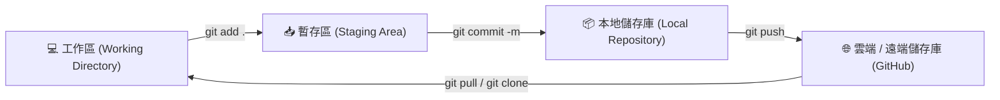

# Git 常用基礎指令速查表

這是一份適合日常開發使用的 Git 基礎指令清單，幫助您快速回顧與查閱。

## 📊 Git 生命週期與指令流向圖

---

## 🚀 1. 開始與初始化

| 指令 | 說明 |
| :--- | :--- |
| `git init` | 在當前資料夾初始化一個新的本地 Git 儲存庫（建立 `.git` 資料夾） |
| `git clone <遠端儲存庫網址>` | 下載（複製）遠端的專案至本地，並自動建立好連結 |

---

## 📝 2. 日常工作流程（暫存與提交）

| 指令 | 說明 |
| :--- | :--- |
| `git status` | 檢查目前工作區與暫存區的檔案狀態（哪些修改了、哪些未追蹤） |
| `git add <檔案名稱>` | 將指定檔案加入暫存區（Staging Area） |
| `git add .` | 將**所有**修改或新增的檔案一次加入暫存區 |
| `git commit -m "提交訊息"` | 將暫存區的檔案正式存入本地儲存庫，並加上版本說明 |
| `git diff` | 比較目前工作區與暫存區的程式碼差異 |
| `git diff --cached` | 比較暫存區與上一次提交（HEAD）的差異 |

---

## 🌿 3. 分支管理 (Branch)

| 指令 | 說明 |
| :--- | :--- |
| `git branch` | 列出本地所有分支（當前所在分支旁會有 `*` 號） |
| `git branch -a` | 列出本地與遠端的所有分支 |
| `git branch <新分支名稱>` | 建立一個新的分支，但不會自動切換過去 |
| `git checkout <分支名稱>` | 切換到指定分支 |
| `git switch <分支名稱>` | 切換到指定分支（較新的 Git 推薦指令） |
| `git checkout -b <新分支名稱>` | 建立一個新分支並直接切換過去 |
| `git switch -c <新分支名稱>` | 建立一個新分支並直接切換過去（較新的 Git 推薦指令） |
| `git merge <分支名稱>` | 將指定分支的內容合併到目前所在的分支 |
| `git branch -d <分支名稱>` | 刪除已合併的指定分支 |

---

## 🌐 4. 遠端同步 (Remote Sync)

| 指令 | 說明 |
| :--- | :--- |
| `git remote -v` | 查看目前連結的遠端儲存庫網址 |
| `git remote add origin <網址>` | 連結本地專案與遠端儲存庫（通常命名為 `origin`） |
| `git push -u origin <分支名稱>` | 首次推送：將本地分支推送到遠端，並建立追蹤關係（之後只需輸入 `git push`） |
| `git push` | 將本地的最新提交推送到遠端儲存庫 |
| `git pull` | 拉取遠端最新變更，並**自動合併**到目前的工作區 |
| `git fetch` | 下載遠端的最新歷史紀錄，但**不會**自動合併到您的檔案中 |

---

## ⏪ 5. 歷史紀錄與復原 (Undo & History)

| 指令 | 說明 |
| :--- | :--- |
| `git log` | 查看完整的提交歷史紀錄 |
| `git log --oneline` | 以精簡的一行格式查看提交歷史紀錄 |
| `git restore <檔案名稱>` | 放棄工作區中某個檔案的修改（回復到上一次提交的狀態） |
| `git reset HEAD <檔案名稱>` | 將檔案從暫存區中移出（取消 `git add`），但保留檔案內容修改 |
| `git reset --hard HEAD` | ⚠️ **危險指令**：徹底放棄工作區與暫存區的所有修改，強制回到上一次提交的狀態 |
| `git revert <Commit Hash>` | 透過新增一個「反向操作()」的新提交，來撤銷某次特定的提交歷史 |
